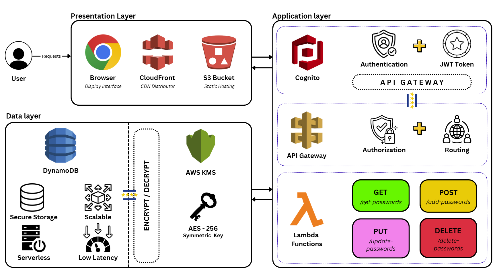

# KIS – Keep It Safe 🔐

**KIS (Keep It Safe)** is a premium, modern, and highly secure Personal Password Manager. Built with the philosophy of minimal design and robust security, KIS allows you to seamlessly store, manage, and update your sensitive credentials with absolute peace of mind.

## System Design

<p align="center">
  
</p>

## Key Features

- **Store & Manage Passwords**: Securely add, view, update, and delete credentials.
- **Copy to Clipboard**: Seamless 1-click password copying.
- **Show/Hide Credentials**: Toggle password visibility securely.
- **SaaS Inspired UI/UX**: Clean Light and Dark modes adorned with luxurious Gold accents.
- **Serverless AWS Architecture**: Infinite scalability and zero-idle costs using AWS Lambda and DynamoDB.
- **AWS Hosted UI Integration**: Robust authentication natively handled through Amazon Cognito without manual token entry.
- **Zero-Knowledge Encrypted Backend**: Enterprise-grade infrastructure ensuring your vault remains mathematically impenetrable.

---

## How It Works

1. **Authentication:** The user logs in via the robust Amazon Cognito Hosted UI.
2. **Token Exchange:** Upon successful login, the application securely retrieves and validates the JWT `access_token` and `id_token` in the background.
3. **Data Retrieval:** The React Dashboard securely calls an Amazon API Gateway endpoint to fetch your personalized password vault.
4. **Serverless Execution:** Every CRUD operation (Create, Read, Update, Delete) routes through API Gateway to trigger an ephemeral AWS Lambda function. The Lambda container executes the logic, communicates with Amazon DynamoDB, and terminates instantly.
5. **Zero-Knowledge Encryption:** Before any sensitive data is written to DynamoDB, Lambda invokes AWS KMS to perform Envelope Encryption, guaranteeing that plain-text passwords never touch the database.
6. **Session Management:** Built-in Axios interceptors continuously monitor token validity, triggering a graceful, automatic logout if a `401 Unauthorized` token expiration occurs.

---

## Tech Stack & Serverless Cloud Infrastructure

### Frontend
- **Framework:** React.js (Bootstrapped with Vite)
- **Routing:** React Router DOM (Protected & Public routes)
- **Styling:** Vanilla CSS (Context-based Light/Dark Theme variables)
- **Animations:** Framer Motion (for modals and layout transitions)
- **HTTP Client:** Axios (Interceptors for Bearer token injection)

### AWS Cloud Services
The application relies on an advanced, strictly **Serverless** Amazon Web Services (AWS) architecture. There are **no EC2 instances** or traditional servers used in this project:
- **Amazon S3:** Securely hosts the static, optimized React frontend files.
- **Amazon API Gateway:** Acts as the highly scalable "front door" for all backend API requests, routing them securely to Lambda.
- **AWS Lambda:** Provides event-driven, stateless compute power to execute backend CRUD logic, scaling automatically from zero to thousands of concurrent executions.
- **Amazon DynamoDB:** A highly scalable NoSQL database utilizing Single-Table Design to store encrypted user vaults with single-digit millisecond latency.
- **Amazon Cognito:** Manages the User Pool and Hosted UI for secure, robust identity verification and JWT issuance.
- **AWS KMS (Key Management Service):** Manages the Customer Master Keys (CMKs) used for Envelope Encryption, ensuring data is mathematically secure at rest.
- **AWS IAM (Identity and Access Management):** Enforces strict, least-privilege role-based access control (RBAC) between services.
- **Amazon CloudWatch:** Monitors application performance, logs Lambda executions, and tracks system health.

---

## Security Considerations

Security is the core foundation of KIS:
- **Zero-Knowledge Architecture:** Plain-text passwords are never sent to the database. They are encrypted within Lambda via AWS KMS before storage.
- **No Monolithic Servers:** By eliminating EC2 instances, we eliminate the risk of OS-level vulnerabilities, SSH exploits, and localized server hacking.
- **In-transit Encryption:** All HTTP traffic is forced over TLS/SSL (HTTPS) ensuring data cannot be intercepted via Man-in-the-Middle attacks.
- **Cognito JWT Validation:** Tokens are strictly validated at the edge by API Gateway before Lambda is ever invoked.

---

## Installation Instructions

### Prerequisites
- Node.js (v18.0 or higher)
- NPM or Yarn
- Valid AWS Cognito Client ID, Cognito Domain, and API Gateway URL.

### Local Setup
1. Clone the repository:
   ```bash
   git clone https://github.com/rbsk-05/KIS-Keep-It-Simple.git
   cd KIS-Keep-It-Simple
   ```

2. Install dependencies:
   ```bash
   npm install
   ```

3. Create a `.env` file in the root directory and add your AWS credentials:
   ```env
   VITE_COGNITO_CLIENT_ID=your_client_id
   VITE_COGNITO_DOMAIN=your_cognito_domain
   VITE_API_GATEWAY_URL=your_api_url
   ```

4. Start the development server:
   ```bash
   npm run dev
   ```

5. Open your browser and navigate to `http://localhost:5173`.

---

## Usage Guide

1. **Login:** Click "Login with AWS Cognito". You will be safely redirected to the AWS Hosted UI.
2. **Dashboard:** Once authenticated, you will see your vault. Toggle Light/Dark mode using the top-right navigation icon.
3. **Add Entry:** Use the top panel to add the Site, your Username, and your Password. Click "Add Password".
4. **Edit Entry:** Find the specific credential card, click "Edit", modify your inputs in the pop-up modal, and hit "Save Changes".
5. **Delete Entry:** Click the "Delete" trash icon on a card to immediately remove the entry from your AWS vault.

---

## Project Structure

```text
KIS-Keep-It-Simple/
├── public/                 # Static public assets (design diagram)
├── src/
│   ├── components/
│   │   ├── layout/         # Persistent UI structures (Navbar, Layout wrappers)
│   │   └── ui/             # Reusable UI primitives (Buttons, Inputs, Cards, ui.css)
│   ├── context/            # Global React states (AuthContext, ThemeContext)
│   ├── pages/              # Primary route views (Login, Dashboard)
│   ├── services/           # External integrations (api.js containing all Axios logic)
│   ├── App.jsx             # React Router definitions and route protection
│   ├── index.css           # Global reset and thematic CSS variables
│   └── main.jsx            # Entry point bridging Context Providers
├── terraform/              # Infrastructure-as-Code definitions (main.tf, etc.)
├── Report-&-Certificate/   # Project report generation tools and docs
├── index.html              # Core HTML template
├── package.json            # Deployment scripts & dependencies
├── vite.config.js          # Vite build configurations
└── README.md               # You are here!
```

---

## Future Improvements

- [ ] Implement robust multi-factor authentication (MFA) via AWS Cognito.
- [ ] Add a secure password generator tool within the Add/Edit form.
- [ ] Incorporate vault synchronization across multiple devices via WebSockets.
- [ ] Perform detailed security audits and potential SOC2 compliance alignments.

---

## 👨‍💻 Author

Built and maintained with ❤️ for maximum security and simplicity.
*Repository:* [rbsk-05/KIS-Keep-It-Simple](https://github.com/rbsk-05/KIS-Keep-It-Simple)
